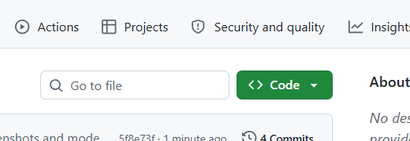
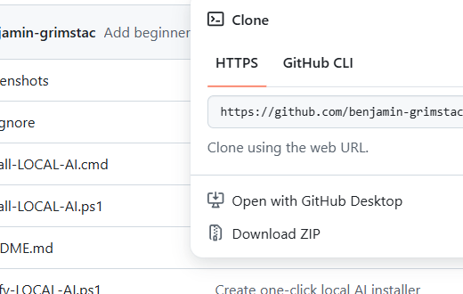

# LOCAL-AI One-Click Installer

This is a simple Windows installer for running a good local AI coding setup without needing to understand terminals, GitHub, model files, or server setup.

You do not need to know GitHub, git, coding, PowerShell, or terminals.

The goal is simple:

1. Download the ZIP.
2. Double-click the installer.
3. Start the local server.
4. Open OpenCode Desktop.

No cloud API key is required. The model runs on your own computer.

## Why Use This

- No command line knowledge required
- No OpenCode setup required
- No model hunting required
- No cloud AI account required
- Runs locally on consumer hardware
- Uses a strong local GGUF model that is downloaded and configured for you

This is meant for people who want a working local AI coding setup without spending a weekend learning the tooling first.

## What You Get

After installing, you will have two shortcuts on your Desktop:

- `Start llama.cpp Server`
- `OpenCode Desktop`

Use them in that order.

This gives you:

- A local llama.cpp AI server
- OpenCode Desktop GUI
- A downloaded local GGUF model
- OpenCode automatically pointed at that local model
- A setup that has been tested on a normal consumer GPU

## Before You Start

You need:

- A Windows 10 or Windows 11 computer
- An internet connection
- At least 25 GB of free disk space
- An NVIDIA GPU is recommended and was used for testing

The AI model is about 17 GB. The installer downloads it for you, so it may take a while depending on your internet speed.

## Tested Hardware And Speed

This setup was tested on a normal desktop gaming/workstation build:

| Part | Tested Build |
| --- | --- |
| CPU | AMD Ryzen 7 5700X 8-Core Processor |
| GPU | NVIDIA GeForce RTX 3070 |
| VRAM | 8 GB |
| RAM | 32 GB |
| Prompt processing speed | About 245-254 tokens per second |
| Text generation speed | About 24-28 tokens per second |

That means this is not meant only for giant workstation machines. Performance will vary, but the tested build is a realistic consumer PC.

Example from a real run on that build:

```text
prompt eval time = 178961.04 ms / 43960 tokens = 245.64 tokens per second
eval time        =  17106.74 ms /   417 tokens =  24.38 tokens per second
```

## What Model It Uses

The installer uses this exact model file:

```text
Qwen3.6-35B-A3B-Uncensored-Genesis-MTP-APEX-Compact.gguf
```

Model source page:

```text
https://huggingface.co/LuffyTheFox/Qwen3.6-35B-A3B-Uncensored-Genesis-V2-APEX-MTP-GGUF
```

Exact model file page:

```text
https://huggingface.co/LuffyTheFox/Qwen3.6-35B-A3B-Uncensored-Genesis-V2-APEX-MTP-GGUF/blob/main/Qwen3.6-35B-A3B-Uncensored-Genesis-MTP-APEX-Compact.gguf
```

Direct model download used by the installer:

```text
https://huggingface.co/LuffyTheFox/Qwen3.6-35B-A3B-Uncensored-Genesis-V2-APEX-MTP-GGUF/resolve/main/Qwen3.6-35B-A3B-Uncensored-Genesis-MTP-APEX-Compact.gguf
```

If the direct download link ever shows an error in a browser, use the exact model file page above. The installer also retries with a fallback Hugging Face download URL automatically.

Approximate model size: `17 GB`.

The model runs locally on your computer through `llama.cpp`. OpenCode is configured to talk to the local server at:

```text
http://127.0.0.1:11434/v1
```

`127.0.0.1` means your own computer.

## OpenCode Is Configured Automatically

You do not need to set up OpenCode yourself.

The installer automatically writes the OpenCode settings file here:

```text
%USERPROFILE%\.config\opencode\opencode.json
```

If an OpenCode settings file already exists, the installer backs it up first inside:

```text
Desktop\LOCAL-AI\backups
```

The automatic config tells OpenCode Desktop to use the local llama.cpp server on your own computer.

It also sets the default OpenCode model to the local model:

```text
llamacpp/qwen-local
```

That means OpenCode should use the downloaded local GGUF model by default, not an online model provider.

## Download The Installer From GitHub

1. Open this page in your web browser:

```text
https://github.com/benjamin-grimstac/Local-Llama.ccp-Opencode-Installer
```

You should see a page like this:



2. Look for the green `Code` button near the top of the page.

3. Click the green `Code` button.

4. Click `Download ZIP`.

It looks like this:



5. Wait for the ZIP file to download.

It will usually go to your `Downloads` folder.

## Unzip The Download

1. Open your `Downloads` folder.

2. Find the downloaded ZIP file. It will have a name like:

```text
Local-Llama.ccp-Opencode-Installer-main.zip
```

3. Right-click the ZIP file.

4. Click `Extract All...`.

5. Click `Extract`.

Windows will create a normal folder with the installer files inside.

## Run The Installer

1. Open the extracted folder.

2. Find this file:

```text
Install-LOCAL-AI.cmd
```

3. Double-click `Install-LOCAL-AI.cmd`.

4. If Windows asks whether you want to run it, choose `Run` or `More info` then `Run anyway`.

5. Leave the installer window open until it says installation is complete.

The installer may look quiet during large downloads. Do not close it unless it shows an error.

## Start LOCAL-AI

After install, go to your Desktop.

1. Double-click `Start llama.cpp Server`.

2. Wait for the server window to finish loading.

3. Leave that server window open.

4. Double-click `OpenCode Desktop`.

Keep the `Start llama.cpp Server` window open while using OpenCode Desktop.

## What The Installer Does

The installer automatically:

- Creates a `LOCAL-AI` folder on your Desktop
- Downloads `llama.cpp`
- Downloads NVIDIA CUDA support files
- Downloads the Qwen GGUF AI model
- Installs OpenCode Desktop
- Configures OpenCode Desktop to use your local AI server
- Creates the two Desktop shortcuts

## Where Files Are Installed

Everything is installed here:

```text
Desktop\LOCAL-AI
```

Inside that folder, you may see:

```text
Desktop\LOCAL-AI\llama.cpp
Desktop\LOCAL-AI\models
Desktop\LOCAL-AI\downloads
Desktop\LOCAL-AI\runtime
Desktop\LOCAL-AI\logs
Desktop\LOCAL-AI\config
```

You do not need to open or edit these folders.

## If Something Goes Wrong

First, try running the installer again:

```text
Install-LOCAL-AI.cmd
```

It is safe to run it again. It will reuse files that already downloaded and fill in anything missing.

Common causes of problems:

- Your internet connection dropped
- Your computer ran out of disk space
- Windows blocked the installer
- The AI model download was interrupted

The install log is here:

```text
Desktop\LOCAL-AI\logs\install.log
```

## If OpenCode Does Not Respond

Make sure you started the server first.

The correct order is:

1. `Start llama.cpp Server`
2. `OpenCode Desktop`

If you closed the server window, double-click `Start llama.cpp Server` again.

## Uninstall

To remove LOCAL-AI:

1. Delete this folder:

```text
Desktop\LOCAL-AI
```

2. Delete these shortcuts from your Desktop:

- `Start llama.cpp Server`
- `OpenCode Desktop`

3. If you also want to remove OpenCode Desktop, uninstall it from Windows Apps settings.

## Sources

- llama.cpp release: https://github.com/ggml-org/llama.cpp/releases/tag/b9264
- llama.cpp CUDA zip: https://github.com/ggml-org/llama.cpp/releases/download/b9264/llama-b9264-bin-win-cuda-13.1-x64.zip
- CUDA DLL zip: https://github.com/ggml-org/llama.cpp/releases/download/b9264/cudart-llama-bin-win-cuda-13.1-x64.zip
- model repo: https://huggingface.co/LuffyTheFox/Qwen3.6-35B-A3B-Uncensored-Genesis-V2-APEX-MTP-GGUF
- OpenCode Desktop: https://opencode.ai/download/stable/windows-x64-nsis
